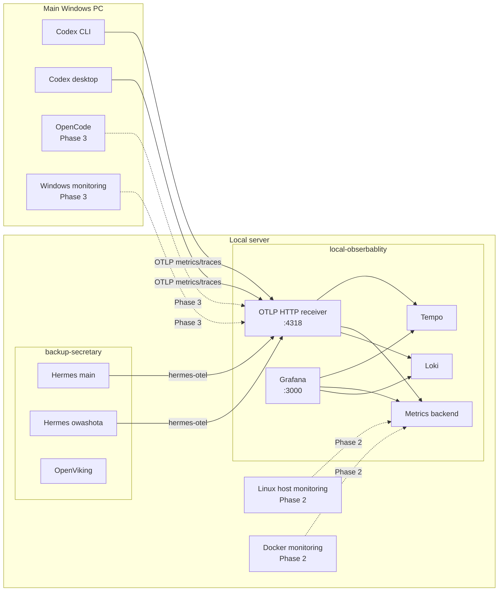

# Architecture

## Responsibility boundary

`local-obserbablity` owns collection, storage, querying, dashboards and monitoring runbooks.

`backup-secretary` owns Hermes, OpenViking and related application configuration. It should contain only the minimum dependency and connection changes needed to emit telemetry.

Neither repository should require the other to be healthy at runtime. Telemetry export must fail open.

## Target architecture



## Phase 1 backend

Use `grafana/otel-lgtm` as the bootstrap backend. It provides a ready-to-use OTel receiver, Grafana, Tempo, Loki and a metrics backend. It is intended for development/demo/test use, so the implementation must:

- pin the image version;
- persist `/data`;
- document backup and restore;
- keep migration to split components possible;
- reassess the backend before long-term retention becomes important.

## Connectivity

### Windows to local server

Windows Codex clients send OTLP/HTTP to the server LAN address on TCP 4318. Grafana is reached on TCP 3000.

Required controls:

- private LAN only;
- host firewall allow-list for the main PC or trusted subnet;
- no router port-forwarding;
- no public tunnel;
- no credentials or private IPs committed to Git.

### Hermes to collector

Preferred design:

1. `local-obserbablity` creates a stable named Docker network such as `local-observability-net`.
2. `backup-secretary` attaches the Hermes services to that network as an external network.
3. Hermes sends to the collector service name over Docker networking.

This avoids depending on host-gateway behavior and separates the two Compose projects while allowing internal service discovery.

If the real host makes this impractical, Hermes may send to the host LAN endpoint. The implementation must then verify Linux container-to-host routing and firewall rules.

## Service identity

Use stable OTel resource identity.

Suggested values:

| Source | `service.name` | `service.instance.id` |
|---|---|---|
| Codex CLI/app | emitted by Codex | distinguish with `originator` / `session_source` |
| Hermes main | `backup-secretary-hermes` | `main` |
| Hermes owashota | `backup-secretary-hermes` | `owashota` |
| OpenCode | `opencode` | `main-windows` |
| Linux host | `local-server` | host name or stable local identifier |
| Windows host | `windows-main` | stable local identifier |

For `hermes-otel`, `project_name` becomes `service.name`. Additional tags can be supplied through `resource_attributes`.

## Discord user accounting

`hermes-otel` supports opt-in sender capture. With `capture_sender_id: true`, Discord turns carry:

```text
hermes.sender.id=<raw Discord sender ID>
user.id=discord:<raw Discord sender ID>
```

The root `agent` span also contains session-level rolled-up token attributes, allowing direct TraceQL metrics aggregation by `user.id` without adding user labels to every exported metric.

Example query shape:

```traceql
{ resource.service.name = "backup-secretary-hermes" && span:name = "agent" }
| sum_over_time(span."gen_ai.usage.total_tokens") by (span."user.id")
```

Equivalent panels should be created for input, output, cache-read, cache-write and reasoning token attributes when present.

The exact attribute spelling must be verified against real exported spans because provider support varies, especially for cache and reasoning tokens.

## Signal policy

### Phase 1 enabled

- Metrics: enabled for Codex and Hermes.
- Traces: enabled for Codex and Hermes.
- Logs: disabled by default.

### Phase 1 content policy

Do not export:

- user prompt bodies;
- assistant response bodies;
- full conversation history;
- tool arguments;
- tool results;
- general application logs.

Do export operational metadata needed for accounting and diagnosis:

- source/client;
- model/provider;
- token counts;
- durations;
- success/error status;
- tool names/counts;
- Hermes instance;
- Discord sender ID for shared Hermes sessions.

## Failure behavior

- Export is asynchronous where supported.
- Collector unavailability must not block LLM calls or tool execution.
- Queues must be bounded.
- Repeated exporter errors must be visible in local container/application logs without causing restart loops.
- The observability stack may be stopped independently for maintenance.

## Data lifecycle

Phase 1 must document:

- storage path or Docker volume;
- approximate growth after a representative week;
- manual backup and restore;
- retention defaults;
- procedure for deleting telemetry for a specific Discord user if needed.

Automatic retention and compaction tuning can follow after real usage volume is measured.
