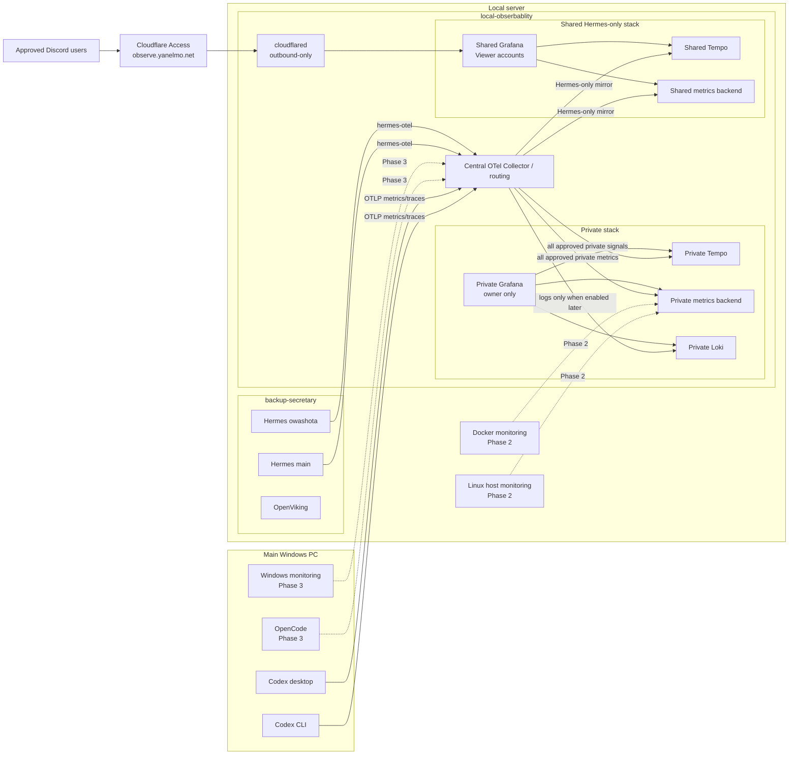

# Architecture

## Responsibility boundary

`local-obserbablity` owns collection, storage, querying, dashboards, shared access and monitoring runbooks.

`backup-secretary` owns Hermes, OpenViking and related application configuration. It should contain only the minimum dependency and connection changes needed to emit telemetry.

Neither repository should require the other to be healthy at runtime. Telemetry export must fail open.

## Target architecture



## Phase 1 backends

Use pinned `grafana/otel-lgtm` stacks or an equivalent reviewed topology as the bootstrap implementation.

Phase 1 has two security domains:

1. **Private stack** — receives Codex and Hermes telemetry. Future server, OpenCode and Windows telemetry also belongs here.
2. **Shared stack** — receives only Hermes telemetry approved for all permitted Discord users.

The implementation must:

- pin image versions;
- persist data;
- document backup and restore;
- keep migration to split components possible;
- reassess the bootstrap backend before long-term retention becomes important;
- prove that Codex/private signals are absent from the shared backend.

A second LGTM stack is the preferred initial isolation mechanism. A multi-tenant design is acceptable only after real-machine validation proves that the shared Grafana cannot query the private tenant.

## Connectivity

### Windows to local server

Windows Codex clients send OTLP/HTTP to the server LAN address on TCP 4318 or the verified collector port. The private Grafana is reached only by the owner over the trusted LAN, localhost or SSH forwarding.

Required controls:

- OTLP is private-LAN only;
- host firewall allow-list for the main PC or trusted subnet;
- no router port-forwarding;
- no Cloudflare route to OTLP;
- no Cloudflare route to private Grafana;
- no credentials or private IPs committed to Git.

### Hermes to collector

Preferred design:

1. `local-obserbablity` creates a stable named Docker network such as `local-observability-net`.
2. `backup-secretary` attaches the Hermes services to that network as an external network.
3. Hermes sends to the collector service name over Docker networking.
4. The collector exports Hermes to both private and shared backends and exports Codex only to private storage.

This avoids depending on host-gateway behavior and separates the two Compose projects while allowing internal service discovery.

If the real host makes this impractical, Hermes may send to the host LAN endpoint. The implementation must then verify Linux container-to-host routing and firewall rules.

### Shared Web access

The only Internet-facing hostname is:

```text
https://observe.yanelmo.net
```

Request path:

```text
browser -> Cloudflare Access -> named Cloudflare Tunnel -> shared Grafana
```

Requirements:

- `cloudflared` creates outbound-only connections;
- no Grafana origin port is publicly forwarded;
- Access permits only exact approved identities;
- shared Grafana uses the Access-authenticated email as an auth-proxy identity;
- auto-created accounts default to Viewer;
- owner and local break-glass accounts are the only initial administrators;
- shared Grafana connects only to Hermes-only data sources.

## Permission boundary

Grafana OSS folder/dashboard permissions are useful for UI organization but are not a hard data-security boundary. Users in an organization can query its data sources, and data-source permissions require Grafana Enterprise/Cloud.

Therefore:

- do not place a private all-data source in the shared Grafana organization;
- do not assume hiding a dashboard protects Codex data;
- keep private and shared telemetry separated at backend/tenant level;
- use Cloudflare Access for entrance control and Grafana roles for Viewer/Admin behavior.

## Service identity

Use stable OTel resource identity.

Suggested values:

| Source | `service.name` | `service.instance.id` |
|---|---|---|
| Codex CLI/app | emitted by Codex | distinguish with `originator` / `session_source` |
| Hermes main | `backup-secretary-hermes` | `main` |
| Hermes owashota | `backup-secretary-hermes` | `owashota` |
| OpenCode | `opencode` | `main-windows` |
| Linux host | `local-server` | host name or stable local identifier |
| Windows host | `windows-main` | stable local identifier |

For `hermes-otel`, `project_name` becomes `service.name`. Additional tags can be supplied through `resource_attributes`.

## Discord user accounting

`hermes-otel` supports opt-in sender capture. With `capture_sender_id: true`, Discord turns carry:

```text
hermes.sender.id=<raw Discord sender ID>
user.id=discord:<raw Discord sender ID>
```

The root `agent` span also contains session-level rolled-up token attributes, allowing direct TraceQL metrics aggregation by `user.id` without adding user labels to every exported metric.

Example query shape:

```traceql
{ resource.service.name = "backup-secretary-hermes" && span:name = "agent" }
| sum_over_time(span."gen_ai.usage.total_tokens") by (span."user.id")
```

Equivalent panels should be created for input, output, cache-read, cache-write and reasoning token attributes when present.

The exact attribute spelling must be verified against real exported spans because provider support varies, especially for cache and reasoning tokens.

## Signal policy

### Phase 1 private stack

- Metrics: enabled for Codex and Hermes.
- Traces: enabled for Codex and Hermes.
- Logs: disabled by default.

### Phase 1 shared stack

- Metrics/traces: Hermes only.
- Codex: forbidden.
- Host/OpenCode/Windows telemetry: forbidden.
- Logs: disabled.

### Phase 1 content policy

Do not export:

- user prompt bodies;
- assistant response bodies;
- full conversation history;
- tool arguments;
- tool results;
- general application logs.

Do export operational metadata needed for accounting and diagnosis:

- source/client;
- model/provider;
- token counts;
- durations;
- success/error status;
- tool names/counts;
- Hermes instance;
- Discord sender ID for shared Hermes sessions.

## Failure behavior

- Export is asynchronous where supported.
- Collector or backend unavailability must not block LLM calls or tool execution.
- Queues must be bounded.
- Repeated exporter errors must be visible in local container/application logs without causing restart loops.
- Private stack, shared stack and Cloudflare tunnel may be stopped independently for maintenance.
- Tunnel failure must affect dashboard access only, not collection or agent operation.

## Data lifecycle

Phase 1 must document:

- private and shared storage paths or Docker volumes;
- approximate growth after a representative week;
- manual backup and restore;
- retention defaults;
- user offboarding in Cloudflare Access and Grafana;
- procedure for deleting telemetry for a specific Discord user if needed.

Automatic retention and compaction tuning can follow after real usage volume is measured.
